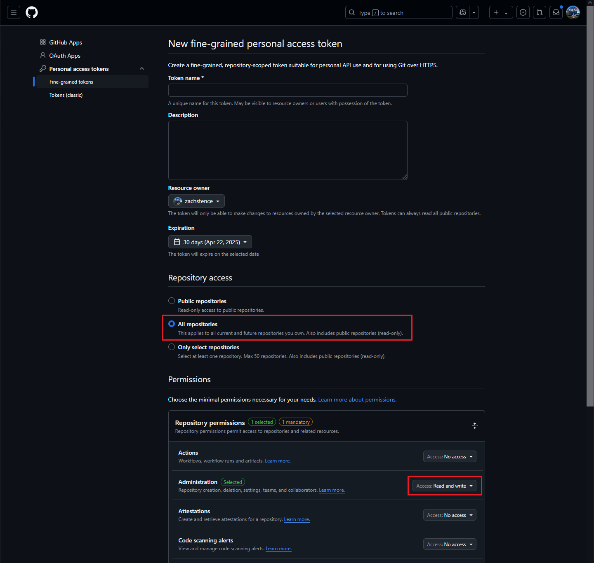

# github-bulk-repo-delete

Bulk delete GitHub repositories with a simple, easy to use script

> [!WARNING]
> By using this tool, you acknowledge and agree that you are solely responsible for the repositories you choose to delete. The developer accepts no responsibility for any data loss or damage that may occur. Use this tool at your own risk.

## Usage

1. Create a GitHub Personal Access Token
	- https://github.com/settings/personal-access-tokens/new
	- Repository access -> All repositories
	- Repository permissions -> Administration -> Read and write
	- <details>
		<summary>Screenshot</summary>

		
		</details>

2. Clone the repo
	```
	git clone github.com/zachstence/github-bulk-repo-delete
	```

3. Run the script
	```
	npm run start
	```
	```
	=-=-= github-bulk-repo-delete =-=-=

	⚠ By using this tool, you acknowledge and agree that you are solely responsible for the repositories you choose to delete. The developer accepts no responsibility for any data loss or damage that may occur. Use this tool at your own risk.
	✔ Type "agree" to continue agree

	✔ Enter your GitHub Personal Access Token: github_pat_*****

	✔ Fetching your repositories...

	✔ Select repositories to delete zachstence/temp

	Are you sure you want to delete the following 1 repositories?
	zachstence/temp
	✔ Type "Delete 1 repositories" to continue delete 1 repositories
	✔ zachstence/temp

	Finished
	```

	You can also specify your PAT via an environment variable
	```
	GITHUB_PERSONAL_ACCESS_TOKEN="github_pat_*****" npm run start
	```
	or in the `.env` file
	```
	GITHUB_PERSONAL_ACCESS_TOKEN="github_pat_*****"
	```
